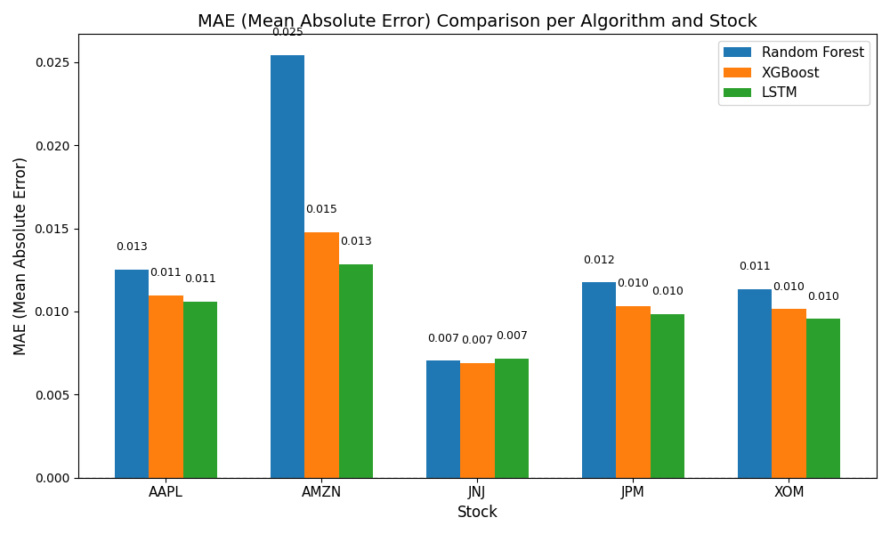
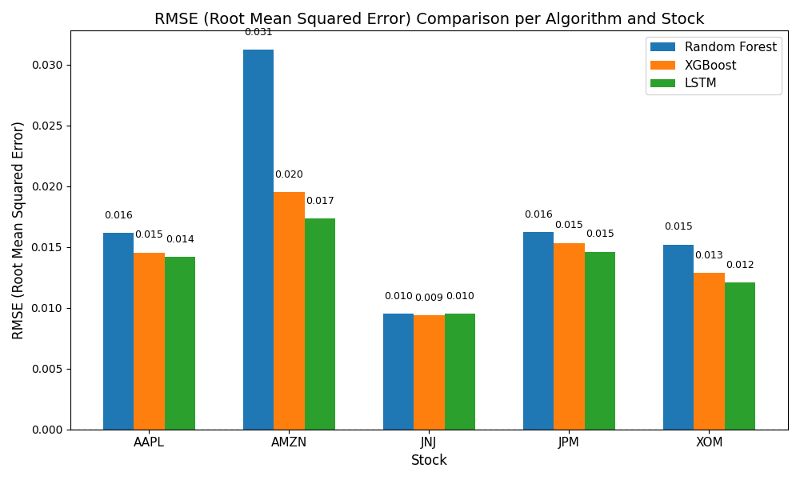

# Multi-Stock Algorithm Comparison

A comprehensive machine learning comparison study for stock return prediction across multiple sectors. This project analyzes the performance of three popular algorithms—**Random Forest**, **XGBoost**, and **LSTM**—on predicting next-day stock returns using advanced technical indicators.

## Overview

This research compares machine learning algorithms for financial time series prediction using:
- **5 major stocks** across different economic sectors
- **28 technical indicators** including moving averages, momentum indicators, and volatility measures
- **3 state-of-the-art algorithms** with hyperparameter optimization
- **Comprehensive performance evaluation** with trading signal generation

## Analyzed Stocks

| Symbol | Company | Sector |
|--------|---------|--------|
| **AAPL** | Apple Inc. | Technology |
| **JPM** | JPMorgan Chase & Co. | Financial |
| **AMZN** | Amazon.com, Inc. | Consumer & Retail |
| **XOM** | Exxon Mobil Corporation | Energy |
| **JNJ** | Johnson & Johnson | Healthcare |

## Technical Features (28 Indicators)

### Price Action
- OHLCV data, Returns, Log returns, Price range, High-Low ratio

### Moving Averages  
- SMA (5, 10, 20, 50 days)
- EMA (12, 26, 50 days)

### Momentum Indicators
- MACD, MACD Signal, MACD Histogram
- RSI (14-day)

### Volatility Indicators
- Bollinger Bands (Upper, Lower, Width)
- ATR (14-day Average True Range)
- Rolling volatility (10-day, 30-day)

### Volume Indicators
- Volume SMA, Volume ratio

## Algorithms Compared

### 1. Random Forest
- **Type**: Ensemble method with decision trees
- **Hyperparameters**: n_estimators, max_depth, min_samples_split
- **Optimization**: RandomizedSearchCV with 3-fold TimeSeriesSplit

### 2. XGBoost
- **Type**: Gradient boosting with advanced regularization  
- **Hyperparameters**: n_estimators, max_depth, learning_rate
- **Optimization**: RandomizedSearchCV with 3-fold TimeSeriesSplit

### 3. LSTM Neural Network
- **Type**: Deep learning with sequential memory for time series
- **Architecture**: 64-unit LSTM → Dropout → 32-unit LSTM → Dense layers
- **Features**: 30-day lookback window, early stopping, Adam optimizer

## Key Results

### Algorithm Performance Summary
| Algorithm | Avg MAE | Avg RMSE | Performance Rank |
|-----------|---------|----------|------------------|
| **LSTM** | 0.00999 | 0.01356 | **1st** |
| **XGBoost** | 0.01062 | 0.01433 | 2nd |
| **Random Forest** | 0.01361 | 0.01767 | 3rd |

### Performance Wins by Metric
- **MAE Wins**: LSTM (4), Random Forest (1), XGBoost (0)
- **RMSE Wins**: LSTM (3), Random Forest (1), XGBoost (1)
- **Total Wins**: LSTM (7), Random Forest (2), XGBoost (1)

## Individual Stock Performance

| Stock | Algorithm | MAE | RMSE |
|-------|-----------|-----|------|
| **AAPL** | LSTM | 0.01058 | 0.01419 |
|  | XGBoost | 0.01096 | 0.01454 |
|  | Random Forest | 0.01252 | 0.01614 |
| **JPM** | LSTM | 0.00984 | 0.01461 |
|  | XGBoost | 0.01032 | 0.01534 |
|  | Random Forest | 0.01175 | 0.01624 |
| **AMZN** | LSTM | 0.01284 | 0.01735 |
|  | XGBoost | 0.01476 | 0.01953 |
|  | Random Forest | 0.02542 | 0.03123 |
| **XOM** | LSTM | 0.00955 | 0.01210 |
|  | XGBoost | 0.01014 | 0.01288 |
|  | Random Forest | 0.01134 | 0.01521 |
| **JNJ** | Random Forest | 0.00704 | 0.00953 |
|  | XGBoost | 0.00691 | 0.00937 |
|  | LSTM | 0.00715 | 0.00954 |

## Trading Signal Performance

### Signal Generation by Sector
- **Technology (AAPL)**: 11.2% action signals (5 buy, 27 sell signals)
- **Financial (JPM)**: 1.4% action signals (1 buy, 3 sell signals)  
- **Consumer Retail (AMZN)**: 0% action signals (complete conservatism)
- **Energy (XOM)**: 1.7% action signals (0 buy, 5 sell signals)
- **Healthcare (JNJ)**: 0% action signals (complete conservatism)

### Signal Accuracy Framework
- **Threshold**: ±0.5% for buy/sell decisions
- **Conservative Approach**: 88.8% - 100% hold signals across sectors
- **Sector Variability**: Technology shows highest activity, Healthcare and Consumer Retail most conservative
- **Model Used**: LSTM-based predictions for signal generation

### Trading Signal Summary
- **Total signals across all stocks**: 6 buy signals, 35 sell signals, 1,389 hold signals
- **Action signal frequency**: varies from 0% (AMZN, JNJ) to 11.2% (AAPL)
- **Most active sector**: Technology (AAPL) with 11.2% action signals
- **Most conservative sectors**: Healthcare (JNJ) and Consumer Retail (AMZN) with 0% action signals
- **Overall strategy**: Predominantly conservative "hold" approach with selective action signals

## Quick Results Preview

### Performance Comparison Charts



### Detailed Results
View complete analysis: [results/multi_stocks_analysis.txt](results/multi_stocks_analysis.txt)

## Installation

### Prerequisites
- Python 3.8+ 
- NVIDIA GPU (optional, for LSTM acceleration)

### Setup
1. Clone the repository:
```bash
git clone https://github.com/SUPERLenn/multi-stock-ml-comparison.git
cd multi-stock-ml-comparison
```

2. (Optional) Create and activate a virtual environment:
```bash
python -m venv venv
source venv/bin/activate       # Mac/Linux
venv\Scripts\activate.bat      # Windows
```

3. Install dependencies:
```bash
pip install -r requirements.txt
```

### Dependencies
- pandas >= 1.5.0
- numpy >= 1.21.0
- yfinance >= 0.2.0
- scikit-learn >= 1.1.0
- xgboost >= 1.6.0
- tensorflow >= 2.13.0
- matplotlib >= 3.5.0

## Usage

### Basic Execution
```bash
python stock_algorithm_comparison.py
```

### Expected Runtime
- **Data Collection**: ~30 seconds (5 stocks × 6 years)
- **Feature Engineering**: ~15 seconds (28 indicators per stock)
- **Model Training**: 5-10 minutes (hyperparameter optimization)
- **Visualization**: ~10 seconds (2 comparison charts)

## Output Files

### Analysis Results
- `multi_stocks_analysis.txt` - Comprehensive results and statistics
- `mae_comparison_grouped.png` - Mean Absolute Error comparison chart
- `rmse_comparison_grouped.png` - Root Mean Squared Error comparison chart

### Expected Results
After running the analysis, you should see:
- **LSTM wins 7/10 performance metrics** across all stocks
- **Consistent MAE and RMSE superiority** for LSTM algorithm
- **Conservative trading signals** with 0-11.2% action frequency
- **Sector-specific patterns** in model performance and signal generation

## Dataset Information

- **Time Period**: January 2019 to December 2024 (6 years of daily data)
- **Data Source**: Yahoo Finance via yfinance library
- **Training/Testing Split**: 80/20 time series split (1,167 train / 292 test)
- **Sample Size**: 1,459 trading days per stock (after preprocessing)
- **Total Data Points**: 204,260 (1,459 days × 5 stocks × 28 features)
- **Cross-Validation**: 3-fold TimeSeriesSplit for hyperparameter optimization

## Methodology

### 1. Data Collection & Preprocessing
- Historical stock data download (1,509 → 1,459 valid samples)
- Data quality validation (100% completeness achieved)
- Missing value handling with forward-fill interpolation

### 2. Feature Engineering  
- 28 technical indicators calculation
- Feature scaling (MinMaxScaler to [0,1] range)
- Target variable creation (next-day returns)

### 3. Model Training & Evaluation
- Hyperparameter optimization via RandomizedSearchCV
- Time series cross-validation (3-fold TimeSeriesSplit)
- Performance evaluation (MAE, RMSE)

### 4. Trading Signal Generation
- Threshold-based signal creation (±0.5%)
- Signal accuracy calculation vs actual market direction
- Performance comparison across algorithms and sectors

### 5. Results Analysis & Visualization
- Statistical performance comparison
- Win-count analysis across 10 metrics (2 metrics × 5 stocks)
- Automated chart generation with matplotlib

## Key Findings

1. **LSTM Superior Performance**: Achieved best results in 7/10 performance metrics with average MAE of 0.00999
2. **Cross-Sector Consistency**: Performance patterns consistent across Technology, Financial, Consumer Retail, Energy, and Healthcare sectors
3. **Technical Indicator Effectiveness**: 28-feature engineering approach provides robust prediction foundation
4. **Algorithm Generalizability**: Multi-stock analysis confirms LSTM reliability across diverse market sectors
5. **Conservative Trading Signals**: Most sectors show 0-1.7% action signals, with Technology sector most active (11.2%)
6. **Sector-Specific Behavior**: Healthcare and Consumer Retail show complete conservatism, Technology shows mixed signals, Financial and Energy show moderate bearish bias

## Research Applications

This study is suitable for:
- **Academic Research**: Financial machine learning and algorithmic trading studies
- **Industry Applications**: Quantitative trading strategy development
- **Educational Purposes**: Machine learning in finance coursework
- **Portfolio Management**: Risk assessment and return prediction across sectors

## Project Structure

```
multi-stock-ml-comparison/
├── src/
│   └── stock_algorithm_comparison.py    # Main analysis script
├── results/
│   ├── multi_stocks_analysis.txt        # Generated results
│   ├── mae_comparison_grouped.png       # MAE visualization
│   └── rmse_comparison_grouped.png      # RMSE visualization
├── requirements.txt                     # Project dependencies
├── README.md                           # Project documentation
├── LICENSE                             # MIT License
└── .gitignore                          # Git ignore rules
```

## Model Performance Details

### Individual Stock Results
- **Best performing stock**: JNJ (Healthcare) - most stable predictions with Random Forest achieving lowest MAE (0.00704)
- **Most challenging stock**: AMZN (Consumer Retail) - highest volatility, LSTM performs significantly better than Random Forest
- **Technology sector (AAPL)**: LSTM achieves best performance with moderate trading signal activity (11.2%)
- **Financial sector (JPM)**: LSTM shows superior performance with low signal activity (1.4%)
- **Energy sector (XOM)**: Close competition between LSTM and XGBoost, with moderate bearish signals

### Algorithm Strengths
- **LSTM**: Superior at capturing temporal dependencies and sequential patterns, particularly effective in volatile sectors
- **XGBoost**: Competitive performance with faster training times, particularly strong in stable healthcare sector
- **Random Forest**: Best performance in low-volatility healthcare sector (JNJ), struggles with high-volatility stocks

### Trading Signal Patterns
- **Technology Sector**: Mixed signals with 11.2% action ratio, predominantly bearish tendency
- **Financial Sector**: Conservative approach with slight bearish bias (1.4% actions)
- **Consumer Retail**: Complete conservatism reflecting high uncertainty in volatile retail market
- **Energy Sector**: Moderate bearish signals (1.7% actions) reflecting sector challenges
- **Healthcare Sector**: Complete conservatism indicating sector stability and predictability challenges

## Contributing

Contributions are welcome! Areas for enhancement:
- Additional technical indicators (Stochastic, Williams %R, etc.)
- More sophisticated neural network architectures (Transformer, GRU)
- Extended stock universe (international markets, different sectors)
- Alternative evaluation metrics (Sharpe ratio, drawdown analysis)
- Real-time data integration and live trading simulation

## Future Research Directions

- **Multi-timeframe analysis**: Incorporating hourly and weekly patterns
- **Sentiment integration**: Adding news sentiment and social media data
- **Ensemble methods**: Combining LSTM and XGBoost predictions
- **Risk-adjusted metrics**: Incorporating volatility-adjusted performance measures
- **Market regime analysis**: Performance during bull vs bear markets

## License

This project is licensed under the MIT License - see the [LICENSE](LICENSE) file for details.

## Disclaimer

⚠️ **Important**: This project is for educational and research purposes only. It is not financial advice. Past performance does not guarantee future results. The moderate prediction accuracy indicates that short-term stock return prediction remains extremely challenging. Always consult with qualified financial professionals before making investment decisions.

---

**Built with Python, TensorFlow, XGBoost, and scikit-learn**  
**Research Period**: 2019-2024 | **Dataset**: 204,260 data points | **Best Algorithm**: LSTM
